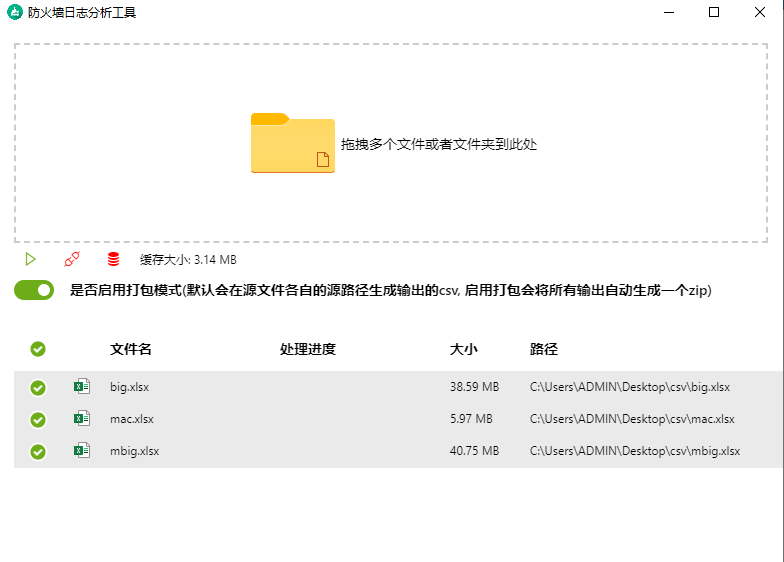

<h1 align="center">防火墙日志分析工具</h1>



## motivation
- js-xlsx库会将所有数据一次性读入内存中, 对于超大文件的xlsx会OOM, 所以使用nodejs的stream进行处理

## Features
- 最新Electron12 + Vite2.0 技术栈
- 流式处理大xlsx文件
- 工作线程支持
- 数据库缓存, 已入库文件秒处理
- 支持自动打包多个输出为zip

## Develop

安装依赖
```bash
  yarn install
```

启动开发环境
```bash
  yarn dev
```

应用打包
```bash
  yarn build
  yarn pack:win
```
## Test
- test目录下提供一个测试xlsx文件, 接近100m, 表记录有5千多万行

## Reference
- [electron-vite-react](https://github.com/twstyled/electron-vite-react)
- [vite-electron-esbuild-starter](https://github.com/jctaoo/vite-electron-esbuild-starter)


## FIXME
- [] 配置nsis打包后会报文件找不到electron的错误
  - 尝试切换electron-builder版本